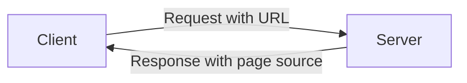
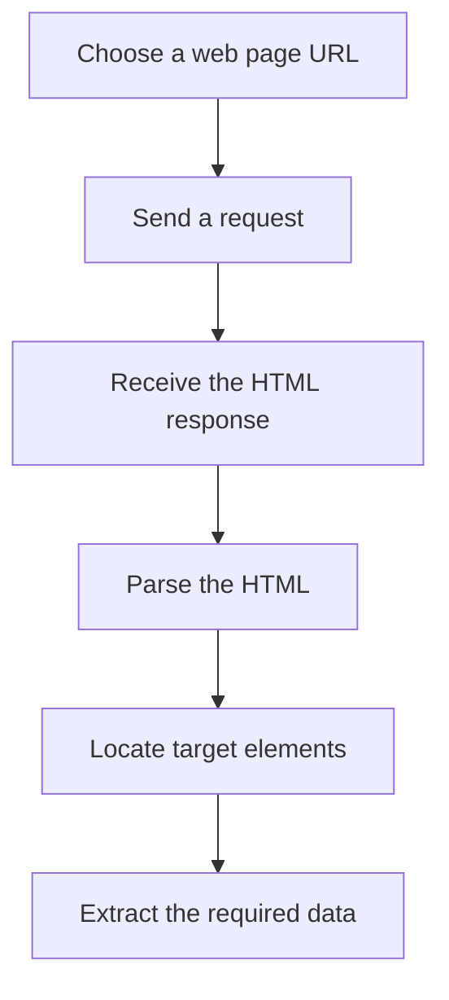

# Intro to Web Scraping

## Table of Contents

1. [What Is Web Scraping?](#what-is-web-scraping)
2. [Why Web Scraping?](#why-web-scraping)
3. [Is Web Scraping Legal?](#is-web-scraping-legal)
4. [Components of a Web Page](#components-of-a-web-page)
5. [HTML Tree Structure](#html-tree-structure)
6. [CSS Classes and IDs](#css-classes-and-ids)
7. [How Web Scraping Works](#how-web-scraping-works)
8. [Actual Response vs. Visual Browser Output](#actual-response-vs-visual-browser-output)
9. [Web-Scraping Workflow](#web-scraping-workflow)
10. [Contact Information](#contact-information)

---

## What Is Web Scraping?

Web scraping is a technique used to access and extract information from a website.

---

## Why Web Scraping?

Web scraping can be used to:

- Collect data that is not available through an API.
- Automate the process of collecting data, saving time and effort.
- Collect data that is updated dynamically.

---

## Is Web Scraping Legal?

> The following points reproduce the guidance presented in the source material and are not legal advice.

According to the presentation:

- Web scraping is legal as long as you are not violating the website's terms of service.
- If the website does not have terms of service, you should be fine.
- Web scraping consumes server resources for the host website.

---

## Components of a Web Page

A web page commonly includes three main components:

| Component | Purpose |
|---|---|
| **HTML** | The markup language that defines the structure of a web page. |
| **CSS** | The language that defines the style of a web page. |
| **JavaScript** | The language that defines the behavior of a web page. |

---

## HTML Tree Structure

HTML documents are organized as a tree of nested elements.

```html
<html>
    <head>
        <title>Page Title</title>
    </head>

    <body>
        <h1>Heading 1</h1>
        <p>Paragraph 1</p>
        <p>Paragraph 2</p>
        <p>Paragraph 3</p>
    </body>
</html>
```

### Structure Overview

- `<html>` is the root element.
- `<head>` stores page metadata, including the title.
- `<body>` contains the visible page content.
- Elements such as headings and paragraphs are nested inside the body.

---

## CSS Classes and IDs

CSS classes and IDs are used to identify specific elements on a web page.

### CSS Classes

A CSS class can identify multiple elements.

```html
<p class="class1">Paragraph 1</p>
<h2 class="class1">Heading 2</h2>
```

Both elements use the same class:

```text
class1
```

### CSS IDs

A CSS ID is used to identify a single element.

```html
<p id="id1">Paragraph 1</p>
```

The element uses the ID:

```text
id1
```

### Classes vs. IDs

| Selector Type | Intended Use |
|---|---|
| **Class** | Identifies multiple elements. |
| **ID** | Identifies one element. |

---

## How Web Scraping Works

Web scraping performs a process similar to what a web browser does:

1. The client sends a request to a server.
2. The request includes a specific URL.
3. The server processes the request.
4. The server returns a response containing the page code.



The presentation describes this as sending a server request with a specific URL and asking the server to return the code for that page.

---

## Actual Response vs. Visual Browser Output

A server response and the page displayed by a browser are related, but they are not the same thing.

### Server Response

The server typically returns source code such as HTML.

Example:

```html
<div class="css-example">
    <h2 class="job-title">
        <a href="/jobs/machine-learning-engineer">
            Machine Learning Engineer
        </a>
    </h2>

    <div class="company">
        <a href="https://example.com/company">Edentech</a>
    </div>
</div>
```

### Browser Output

A browser interprets the HTML, CSS, and JavaScript, then displays a visual page to the user.

A web-scraping script usually receives and processes the source code rather than displaying the page visually.

---

## Web-Scraping Workflow

The workflow presented in the source is:

1. Write code that sends a request to the server hosting the specified page.
2. The server returns the page's source code, usually HTML.
3. Parse the HTML.
4. Extract the required data.



### Key Idea

Unlike a web browser, web-scraping code does not necessarily interpret the source code and display the page visually. Instead, it parses the returned HTML to locate and extract data.


